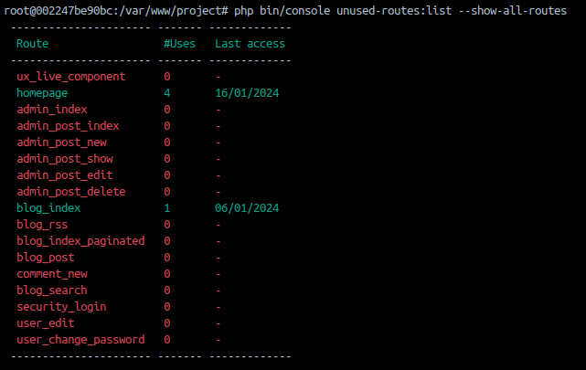

<a name="readme-top"></a>


<!-- PROJECT LOGO -->
<br />
<div align="center">
<h1 align="center">Unused Routes</h1>
  <p align="center">
    <a href="https://github.com/orbeji/unused-routes/issues">Report Bug</a>
    ·
    <a href="https://github.com/orbeji/unused-routes/issues">Request Feature</a>
  </p>
</div>


<!-- ABOUT THE PROJECT -->
## About The Project

This project is a Symfony bundle that gives you information about the (un)used routes in your application.
With this information you can safely delete the unused routes from your code.




<p align="right">(<a href="#readme-top">back to top</a>)</p>


<!-- GETTING STARTED -->
## Getting Started

### Installation

Make sure Composer is installed globally, as explained in the
[installation chapter](https://getcomposer.org/doc/00-intro.md)
of the Composer documentation.

### Applications that use Symfony Flex

Open a command console, enter your project directory and execute:

```console
$ composer require orbeji/unused-routes
```

### Applications that don't use Symfony Flex

#### Step 1: Download the Bundle

Open a command console, enter your project directory and execute the
following command to download the latest stable version of this bundle:

```console
$ composer require orbeji/unused-routes
```

#### Step 2: Enable the Bundle

Then, enable the bundle by adding it to the list of registered bundles
in the `config/bundles.php` file of your project:

```php
// config/bundles.php

return [
    // ...
    Orbeji\UnusedRoutes\UnusedRoutesBundle::class => ['all' => true],
];
```


<!-- USAGE EXAMPLES -->
## Usage

After the installation the bundle will start registering the users activity.
This activity will be stored by default in a file in `%kernel.logs_dir%/accessed_routes{Ymd}.log`

To know which routes are unused execute the following command:
```bash
php bin/console unused-routes:list
```
This will show a table like this:
```bash
---------------------- ------- ------------- 
  Route                  #Uses   Last access  
 ---------------------- ------- ------------- 
  ux_live_component      0       -            
  admin_index            0       -            
  admin_post_index       0       -            
  admin_post_new         0       -            
  admin_post_show        0       -            
  admin_post_edit        0       -            
  admin_post_delete      0       -            
  blog_rss               0       -            
  blog_index_paginated   0       -            
  blog_post              0       -            
  comment_new            0       -            
  blog_search            0       -            
  security_login         0       -            
  user_edit              0       -            
  user_change_password   0       -            
 ---------------------- ------- -------------
 ```

Also you can pass the option `--show-all-routes` to add the info of the used routes
```bash
php bin/console unused-routes:list --show-all-routes
```
This will show a table like this:
```
---------------------- ------- ------------- 
  Route                  #Uses   Last access  
 ---------------------- ------- ------------- 
  ux_live_component      0       -            
  homepage               4       16/01/2024   
  admin_index            0       -            
  admin_post_index       0       -            
  admin_post_new         0       -            
  admin_post_show        0       -            
  admin_post_edit        0       -            
  admin_post_delete      0       -            
  blog_index             1       06/01/2024   
  blog_rss               0       -            
  blog_index_paginated   0       -            
  blog_post              0       -            
  comment_new            0       -            
  blog_search            0       -            
  security_login         0       -            
  user_edit              0       -            
  user_change_password   0       -            
 ---------------------- ------- -------------
 ```
Now the routes that have been accessed also appear here with some info of the number of acceses and the date of the last one.

<p align="right">(<a href="#readme-top">back to top</a>)</p>

### Configuration
There are only two parameters in this bundle. The path where the file is stores and the filename.
```yaml
unused_routes:
  file_path: '%kernel.logs_dir%'
  file_name: 'accessed_routes.log'
```
### Replacing how logs are stored/read 
If you want to replace the way of storing logs like using a database or another storaging strategy you can create your own service implementing the following interface:
```php
<?php

declare(strict_types=1);

namespace Orbeji\UnusedRoutes\Provider;

use Orbeji\UnusedRoutes\Entity\UsedRoute;

interface UsageRouteProviderInterface
{
    /**
     * Everytime a user accesses a route this method is called to store this usage
     */
    public function addRoute(UsedRoute $route): void;

    /**
     * This method aggregates all UsedRoutes by the used route and sums all visits, leaving the timestamp of the last
     * visit
     * @return UsedRoute[]
     */
    public function getRoutesUsage(): array;
}
```
Then you should add this to your services.yaml

```yaml
services:
  Orbeji\UnusedRoutes\Provider\UsageRouteProviderInterface: '@your_own_service'
```

<!-- ROADMAP -->
## Roadmap

- [x] Write a log file per day
- [x] Add tests
- [x] Add pipelines
  - [x] Check style
  - [x] Run Tests
  - [x] Coverage check
  - [x] Phpstan
- [x] Improve Readme with description and usage
- [ ] Multiple routes can be assigned to the same action, take this into account in the result table
- [ ] See if it's possible/worth it to autogenerate a bundle config file when installing
- [ ] Add more methods to store/read logs
- [ ] Add configuration to replace how we store/read logs


See the [open issues](https://github.com/orbeji/unused-routes/issues) for a full list of proposed features (and known issues).

<p align="right">(<a href="#readme-top">back to top</a>)</p>


<!-- CONTRIBUTING -->
## Contributing

Pull requests are welcome. For major changes, please open an issue first
to discuss what you would like to change.

Please make sure to update tests as appropriate and that all the Github Actions are passing.

<p align="right">(<a href="#readme-top">back to top</a>)</p>


<!-- LICENSE -->
## License

Distributed under the [MIT](https://choosealicense.com/licenses/mit/) License. 

<p align="right">(<a href="#readme-top">back to top</a>)</p>


<!-- CONTACT -->
## Contact

Project Link: [https://github.com/orbeji/unused-routes](https://github.com/orbeji/unused-routes)

<p align="right">(<a href="#readme-top">back to top</a>)</p>
